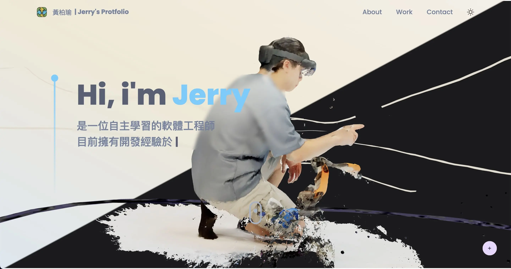

# Jerry's Portfolio

## Author

👤 **Jerry Huang（黃柏瑜）**

- GitHub: [@jerryhuangyu](https://github.com/jerryhuangyu)
- LinkedIn: [Jerry Huang](https://www.linkedin.com/in/jerry-huang-317721227/)

## Preview

## Build With

- Three: 3d model
- Framer Motion: animation library
- i18next: internationalization framework
- Tailwindcss: css framework

## Live Demo

Click [here](https://jerry-portfolio.vercel.app/) to view the live demo.

## Feedback

Give a ⭐️ if you like this project!